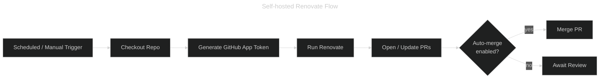

---
hide:
  - toc
---

# Renovate

**Renovate** is an open-source dependency-update tool that automates the creation of pull requests whenever a new version of a dependency is detected. Unlike the GitHub-hosted SaaS offering, this workflow runs Renovate **self-hosted** on your own runner, giving you fine-grained control over scheduling, tokens, and execution environment.

Authentication is handled through a **GitHub App** (not a long-lived PAT), which allows precise, least-privilege repository access.

## Architecture



## Prerequisites

### GitHub App

Create a dedicated GitHub App for Renovate with the following **repository permissions**:

| Permission           | Access        |
|----------------------|---------------|
| Contents             | Read & Write  |
| Issues               | Read & Write  |
| Pull requests        | Read & Write  |
| Workflows            | Read & Write  |
| Metadata             | Read-only     |

Once created, install the App on the target repositories and store the credentials as secrets:

| Secret name                 | Description                             |
|-----------------------------|-----------------------------------------|
| `RENOVATE_APP_ID`           | Numeric GitHub App ID                   |
| `RENOVATE_APP_PRIVATE_KEY`  | PEM private key generated for the App   |

### Renovate config in consuming repository

Each repository using this workflow must provide a Renovate configuration file (default: `renovate.json5`).
The recommended approach is to extend the shared org preset so every repo inherits the same grouping and policy rules:

```json
{
  "$schema": "https://docs.renovatebot.com/renovate-schema.json",
  "extends": ["github>irishlab-io/.github//renovate/default"]
}
```

## Org Preset — `renovate/default.json5`

The `renovate/default.json5` file at the root of this repository acts as the **shareable base configuration** for all irishlab-io repositories.

### Covered ecosystems

| Ecosystem       | Manager(s)                                    | PR strategy                      |
|-----------------|-----------------------------------------------|----------------------------------|
| GitHub Actions  | `github-actions`                              | Grouped minor + patch per PR     |
| Dockerfile      | `dockerfile`                                  | Grouped minor + patch per PR     |
| Docker Compose  | `docker-compose`                              | Grouped minor + patch per PR     |
| Python (uv)     | `uv`                                          | Grouped minor + patch per PR     |
| Node.js (npm)   | `npm`                                         | Grouped minor + patch per PR     |
| pre-commit      | `pre-commit`                                  | Grouped minor + patch per PR     |
| Helm            | `helmv3`, `helm-values`, `helm-requirements`  | Grouped minor + patch per PR     |
| Terraform       | `terraform`                                   | Grouped minor + patch per PR     |

Major-version bumps always get their own separate PR (`:separateMajorReleases`).

### Key defaults

- **Schedule**: Sundays before 06:00 `America/Toronto`
- **Auto-merge**: Off by default — enable per-repo or via the workflow `auto_merge` input
- **Dependency Dashboard**: Enabled (creates a tracking issue in the repository)
- **Semantic commits**: Enabled via `:semanticCommits`

## Usage

Reference the reusable workflow from any repository schedule:

```yaml
---
name: Renovate

on:
  schedule:
    - cron: "0 2 * * 0"  # Sundays at 02:00 UTC
  workflow_dispatch: {}

jobs:
  renovate:
    name: Renovate Dependency Update
    uses: irishlab-io/.github/.github/workflows/reusable-renovate.yml@main
    secrets:
      RENOVATE_APP_ID: ${{ secrets.RENOVATE_APP_ID }}
      RENOVATE_APP_PRIVATE_KEY: ${{ secrets.RENOVATE_APP_PRIVATE_KEY }}
```

### Enable auto-merge

Pass `auto_merge: true` to let Renovate merge minor and patch PRs automatically once CI passes:

```yaml
jobs:
  renovate:
    uses: irishlab-io/.github/.github/workflows/reusable-renovate.yml@main
    with:
      auto_merge: true
    secrets:
      RENOVATE_APP_ID: ${{ secrets.RENOVATE_APP_ID }}
      RENOVATE_APP_PRIVATE_KEY: ${{ secrets.RENOVATE_APP_PRIVATE_KEY }}
```

## Inputs

| Input         | Required | Default          | Description                                      |
|---------------|----------|------------------|--------------------------------------------------|
| `auto_merge`  | No       | `false`          | Enable auto-merge for patch and minor updates    |
| `config_file` | No       | `renovate.json5` | Path to the Renovate config file in the repo     |
| `log_level`   | No       | `info`           | Renovate log level (`debug`, `info`, `warn`, `error`) |
| `runs_on`     | No       | `self-hosted`    | Runner label(s) for the job                      |

## Secrets

| Secret                      | Required | Description                                              |
|-----------------------------|----------|----------------------------------------------------------|
| `RENOVATE_APP_ID`           | Yes      | GitHub App ID used by Renovate to authenticate           |
| `RENOVATE_APP_PRIVATE_KEY`  | Yes      | GitHub App private key (PEM) for token generation        |

## Full Example

```yaml
---
name: Renovate

on:
  schedule:
    - cron: "0 2 * * 0"
  workflow_dispatch: {}

concurrency:
  group: ${{ github.workflow }}-${{ github.ref }}
  cancel-in-progress: false

jobs:
  renovate:
    name: Renovate Dependency Update
    uses: irishlab-io/.github/.github/workflows/reusable-renovate.yml@main
    with:
      auto_merge: false
      config_file: renovate.json5
      log_level: info
    secrets:
      RENOVATE_APP_ID: ${{ secrets.RENOVATE_APP_ID }}
      RENOVATE_APP_PRIVATE_KEY: ${{ secrets.RENOVATE_APP_PRIVATE_KEY }}
```
