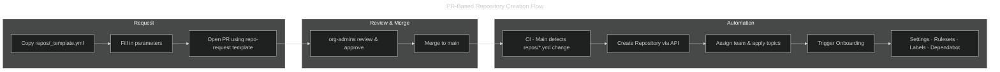
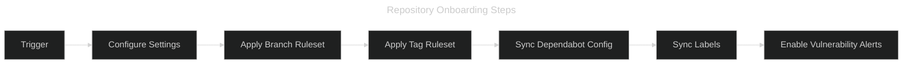

---
hide:
  - toc
---

# Repository Onboarding

All repositories in the organization are provisioned and onboarded using an
automated, GitOps-based pipeline that enforces a common structure, rulesets,
and settings from day one.

## Requesting a New Repository

The **primary** way to create a new repository is to open a Pull Request in the
`.github` repository. This gives the team a code-review gate before anything
is created and produces a full audit trail.



### Step-by-Step

1. **Copy the template** — duplicate `repos/_template.yml` and name it after
   your desired repository (e.g. `repos/svc-payments-api.yml`).
2. **Fill in all fields** — `name`, `description`, `visibility`, `type`,
   `team`, and optional `topics` / `template` / `features`.
3. **Open a Pull Request** — select the **"Repository Request"** template
   (`?template=repo-request.md`) and fill in the checklist.
4. **Assign a reviewer** from the `org-admins` team.
5. **Merge** — once approved and merged to `main`, the pipeline:
   - Creates the repository (from scratch or from a template repo).
   - Assigns the owning team with `maintain` permission.
   - Applies topics.
   - Triggers the full onboarding sequence (see below).

### Repository Config File

```yaml
name: svc-payments-api        # must match the file name
description: "Payments API"
visibility: private            # private | internal | public
type: svc                      # svc | lib | infra | sandbox
team: backend
topics:
  - python
  - api
template: ""                   # leave empty to start from scratch
features:
  wiki: false
  projects: false
  discussions: false
```

Updating a field in an existing config file and merging will **re-apply**
the changed settings. It will **not** re-create the repository.

---

## Onboarding Steps



### Other Trigger Methods

#### Manual — Workflow Dispatch

Organization admins can onboard any existing repository on demand:

```bash
gh workflow run repo.yml \
  --repo irishlab-io/.github \
  -f repo_name=<target-repo-name>
```

#### Automated — GitHub App Webhook

A GitHub App listening for `repository.created` events can fire:

```bash
gh api -X POST repos/irishlab-io/.github/dispatches \
  -f event_type="repository-created" \
  -f client_payload[repo_name]="<new-repo-name>"
```

## What Gets Applied During Onboarding

| Step | Description |
| ---- | ----------- |
| **Repository Settings** | Squash-only merges, auto-delete head branches, disable wiki and projects |
| **Branch Ruleset** | Enforces PR requirements, block force-push and deletion on `main` |
| **Tag Ruleset** | Enforces semantic versioning pattern (`v0.x.x`), block force-push and deletion |
| **Dependabot Config** | Adds `.github/dependabot.yml` with GitHub Actions updates (skipped if file exists) |
| **Labels** | Syncs standard org labels (`type:*`, `priority:*`, `area:*`, and more) |
| **Vulnerability Alerts** | Enables Dependabot vulnerability alerts |

## Organization-Wide Sync

Use the **CI - Organization Sync** workflow to push updated settings and
rulesets to **all** active repositories at once. This is useful after
modifying `rulesets/main.json` or `rulesets/tag.json`.

```bash
# Dry run (no changes applied)
gh workflow run sync.yml \
  --repo irishlab-io/.github \
  -f dry_run=true

# Apply changes to all repositories
gh workflow run sync.yml \
  --repo irishlab-io/.github
```

The sync workflow runs automatically every Sunday at 02:00 UTC to ensure
all repositories remain compliant.

## What Gets Synced Organization-Wide

| Item | Behavior |
| ---- | -------- |
| **Repository Settings** | Always overwritten to enforce the standard |
| **Branch Ruleset** | Created if missing; updated if present |
| **Tag Ruleset** | Created if missing; updated if present |
| **Labels** | Created or updated (`--force`) on every sync |
| **Vulnerability Alerts** | Re-enabled on every sync |
| **Dependabot Config** | Only added during initial onboarding (not overwritten) |

## Configuration Files

| File | Purpose |
| ---- | ------- |
| `repos/_template.yml` | Template for new repository config files |
| `repos/<name>.yml` | Per-repository configuration (one file per repo) |
| `repository-settings.yml` | Documents the enforced default settings |
| `rulesets/main.json` | Branch ruleset definition (main + default branch) |
| `rulesets/tag.json` | Tag ruleset definition (semantic version enforcement) |
| `.github/labels.yml` | Standard organization labels |
| `.github/dependabot-template.yml` | Dependabot template for new repositories |

## Related Documents

- [Organization Overview](overview.md)
- [Bootstrap Checklist](bootstrap-checklist.md)
- [Pipeline Overview](../pipeline/overview.md)
