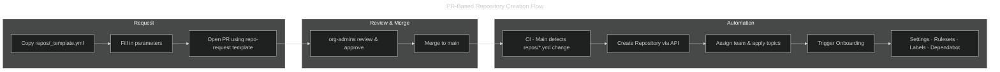
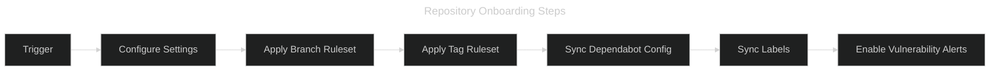

---
hide:
  - toc
---

# Repository Onboarding

All repositories in the organization are provisioned and onboarded using an
automated, GitOps-based pipeline that enforces a common structure, rulesets,
and settings from day one.

## Requesting a New Repository

The **primary** way to create a new repository is to open a Pull Request in the
`.github` repository. This gives the team a code-review gate before anything
is created and produces a full audit trail.



### Step-by-Step

1. **Copy the template** — duplicate `repos/_template.yml` and name it after
   your desired repository (e.g. `repos/svc-payments-api.yml`).
2. **Fill in all fields** — `name`, `description`, `visibility`, `type`,
   `team`, and optional `topics` / `template` / `features`.
3. **Open a Pull Request** — select the **"Repository Request"** template
   (`?template=repo-request.md`) and fill in the checklist.
4. **Assign a reviewer** from the `org-admins` team.
5. **Merge** — once approved and merged to `main`, the pipeline:
   - Creates the repository (from scratch or from a template repo).
   - Assigns the owning team with `maintain` permission.
   - Applies topics.
   - Triggers the full onboarding sequence (see below).

### Repository Config File

```yaml
name: svc-payments-api        # must match the file name
description: "Payments API"
visibility: private            # private | internal | public
type: svc                      # svc | lib | infra | sandbox
team: backend
topics:
  - python
  - api
template: ""                   # leave empty to start from scratch
features:
  wiki: false
  projects: false
  discussions: false
```

Updating a field in an existing config file and merging will **re-apply**
the changed settings. It will **not** re-create the repository.

---

## Onboarding Steps



### Other Trigger Methods

#### Manual — Workflow Dispatch

Organization admins can onboard any existing repository on demand:

```bash
gh workflow run repo.yml \
  --repo irishlab-io/.github \
  -f repo_name=<target-repo-name>
```

#### Automated — GitHub App Webhook

A GitHub App listening for `repository.created` events can fire:

```bash
gh api -X POST repos/irishlab-io/.github/dispatches \
  -f event_type="repository-created" \
  -f client_payload[repo_name]="<new-repo-name>"
```

This webhook-driven trigger is **optional**. The current PR-based repository
creation flow already creates an installation token and calls the GitHub API
directly from GitHub Actions, so a webhook is only needed if you want an
external event source to trigger onboarding.

## GitHub App Setup

The repository creation and onboarding workflows use a GitHub App installation
token generated with `actions/create-github-app-token`. For this setup, create
an **organization-owned** GitHub App and install it on the organization.

### Recommended App Configuration

Use the following defaults when registering the app:

| Setting | Value |
| ---- | ---- |
| **Ownership** | Organization-owned |
| **App name** | `irishlab-bot` (or similar) |
| **Homepage URL** | Your organization URL or `.github` repository URL |
| **Webhook** | Disabled unless you need external event delivery |
| **Installation scope** | Only this account |

### Required Permissions

Grant the following minimum permissions to the GitHub App.

#### Repository permissions

| Permission | Access | Why it is needed |
| ---- | ---- | ---- |
| **Administration** | Read and write | Create repositories, update repository settings, manage topics, enable vulnerability alerts, and manage rulesets |
| **Contents** | Read and write | Trigger `repository_dispatch`, create `.github/dependabot.yml`, and support template-based repository creation |
| **Issues** | Read and write | Sync labels in repositories |
| **Metadata** | Read-only | Provided automatically by GitHub Apps |

#### Organization permissions

| Permission | Access | Why it is needed |
| ---- | ---- | ---- |
| **Members** | Read-only | Resolve teams and assign a team to a repository |

### Permission Mapping to Workflow Actions

| Workflow action | Permission requirement |
| ---- | ---- |
| Check whether a repository already exists | `Metadata: read` |
| Create an organization repository | `Administration: read and write` |
| Create a repository from a template | `Administration: read and write` + `Contents: read and write` |
| Update repository settings | `Administration: read and write` |
| Replace repository topics | `Administration: read and write` |
| Add a team to a repository | `Administration: read and write` + `Members: read` |
| Trigger `repository_dispatch` | `Contents: read and write` |
| Create `.github/dependabot.yml` | `Contents: read and write` |
| Sync labels | `Issues: read and write` |
| Enable vulnerability alerts | `Administration: read and write` |
| Create or update repository rulesets | `Administration: read and write` |

### Installation Scope

Install the GitHub App on the **organization** with access to **All
repositories**.

This is important because the workflows need to:

- create new repositories,
- immediately configure those new repositories, and
- reuse the same installation token across onboarding and organization sync.

If the app is installed only on selected repositories, newly created
repositories will typically not be manageable until the installation scope is
updated.

### Secrets

Store the following values as **organization secrets** and make them available
to the `.github` repository:

| Secret | Value |
| ---- | ---- |
| `IRISHLAB_BOT_APP_ID` | Numeric GitHub App ID |
| `IRISHLAB_BOT_PRIVATE_KEY` | Full contents of the downloaded `.pem` private key |

Recommended practice:

- keep both secrets at the organization level,
- limit repository access to `.github`, and
- pass them to reusable workflows with `secrets: inherit`.

### Setup Steps

1. Open **Organization Settings** → **Developer settings** → **GitHub Apps**.
2. Create a new organization-owned GitHub App.
3. Configure the permissions listed above.
4. Leave webhooks disabled unless you specifically need external event
  handling.
5. Generate and download a private key.
6. Save the App ID and private key contents as `IRISHLAB_BOT_APP_ID` and
  `IRISHLAB_BOT_PRIVATE_KEY`.
7. Install the app on the organization with access to **All repositories**.
8. Run the workflow once to validate token generation and repository
  provisioning.

### Troubleshooting

| Symptom | Likely cause |
| ---- | ---- |
| `Resource not accessible by integration` | Missing app permission or the installation has not approved a newly added permission |
| Token generation fails | Wrong App ID, invalid private key, or app not installed on the organization |
| Newly created repository cannot be configured | App was installed on selected repositories instead of all repositories |
| Team assignment fails | Missing `Members: read` or incorrect team slug |
| `repository_dispatch` fails | Missing `Contents: read and write` |

### Notes on Workflow Permissions

The `permissions:` block in a workflow job mainly controls the default
`GITHUB_TOKEN`. In this repository, the provisioning steps use a GitHub App
installation token exported as `GH_TOKEN`, so the effective permissions come
from the GitHub App configuration, not just the workflow job definition.

## What Gets Applied During Onboarding

| Step | Description |
| ---- | ----------- |
| **Repository Settings** | Squash-only merges, auto-delete head branches, disable wiki and projects |
| **Branch Ruleset** | Enforces PR requirements, block force-push and deletion on `main` |
| **Tag Ruleset** | Enforces semantic versioning pattern (`v0.x.x`), block force-push and deletion |
| **Dependabot Config** | Adds `.github/dependabot.yml` with GitHub Actions updates (skipped if file exists) |
| **Labels** | Syncs standard org labels (`type:*`, `priority:*`, `area:*`, and more) |
| **Vulnerability Alerts** | Enables Dependabot vulnerability alerts |

## Organization-Wide Sync

Use the **CI - Organization Sync** workflow to push updated settings and
rulesets to **all** active repositories at once. This is useful after
modifying `rulesets/main.json` or `rulesets/tag.json`.

```bash
# Dry run (no changes applied)
gh workflow run sync.yml \
  --repo irishlab-io/.github \
  -f dry_run=true

# Apply changes to all repositories
gh workflow run sync.yml \
  --repo irishlab-io/.github
```

The sync workflow runs automatically every Sunday at 02:00 UTC to ensure
all repositories remain compliant.

## What Gets Synced Organization-Wide

| Item | Behavior |
| ---- | -------- |
| **Repository Settings** | Always overwritten to enforce the standard |
| **Branch Ruleset** | Created if missing; updated if present |
| **Tag Ruleset** | Created if missing; updated if present |
| **Labels** | Created or updated (`--force`) on every sync |
| **Vulnerability Alerts** | Re-enabled on every sync |
| **Dependabot Config** | Only added during initial onboarding (not overwritten) |

## Configuration Files

| File | Purpose |
| ---- | ------- |
| `repos/_template.yml` | Template for new repository config files |
| `repos/<name>.yml` | Per-repository configuration (one file per repo) |
| `repository-settings.yml` | Documents the enforced default settings |
| `rulesets/main.json` | Branch ruleset definition (main + default branch) |
| `rulesets/tag.json` | Tag ruleset definition (semantic version enforcement) |
| `.github/labels.yml` | Standard organization labels |
| `.github/dependabot-template.yml` | Dependabot template for new repositories |

## Related Documents

- [Organization Overview](overview.md)
- [Bootstrap Checklist](bootstrap-checklist.md)
- [Pipeline Overview](../pipeline/overview.md)
