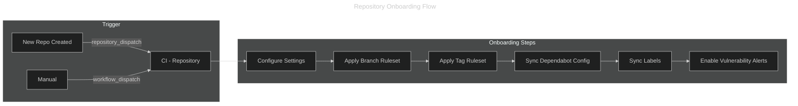

---
hide:
  - toc
---

# Repository Onboarding

All repositories in the organization are onboarded using an automated pipeline
that enforces a common structure, rulesets, and settings from day one.

## How It Works



## Trigger Methods

### Automated — GitHub App Webhook

The recommended approach is to configure a GitHub App to listen for
`repository.created` organization events and fire a `repository_dispatch`
event to this repository.

When a new repository is created, the App calls:

```bash
gh api -X POST repos/irishlab-io/.github/dispatches \
  -f event_type="repository-created" \
  -f client_payload[repo_name]="<new-repo-name>"
```

This triggers the **CI - Repository** workflow, which calls the
`reusable-repo-onboarding.yml` workflow.

### Manual — Workflow Dispatch

Organization admins can onboard any existing repository on demand from
the GitHub Actions UI or via the CLI:

```bash
gh workflow run repo.yml \
  --repo irishlab-io/.github \
  -f repo_name=<target-repo-name>
```

## What Gets Applied

| Step | Description |
| ---- | ----------- |
| **Repository Settings** | Squash-only merges, auto-delete head branches, disable wiki and projects |
| **Branch Ruleset** | Enforces PR requirements, block force-push and deletion on `main` |
| **Tag Ruleset** | Enforces semantic versioning pattern (`v0.x.x`), block force-push and deletion |
| **Dependabot Config** | Adds `.github/dependabot.yml` with GitHub Actions updates (skipped if file exists) |
| **Labels** | Syncs standard org labels (`type:*`, `priority:*`, `area:*`, and more) |
| **Vulnerability Alerts** | Enables Dependabot vulnerability alerts |

## Organization-Wide Sync

Use the **CI - Organization Sync** workflow to push updated settings and
rulesets to **all** active repositories at once. This is useful after
modifying `rulesets/main.json` or `rulesets/tag.json`.

```bash
# Dry run (no changes applied)
gh workflow run sync.yml \
  --repo irishlab-io/.github \
  -f dry_run=true

# Apply changes to all repositories
gh workflow run sync.yml \
  --repo irishlab-io/.github
```

The sync workflow runs automatically every Sunday at 02:00 UTC to ensure
all repositories remain compliant.

## What Gets Synced Organization-Wide

| Item | Behavior |
| ---- | -------- |
| **Repository Settings** | Always overwritten to enforce the standard |
| **Branch Ruleset** | Created if missing; updated if present |
| **Tag Ruleset** | Created if missing; updated if present |
| **Labels** | Created or updated (`--force`) on every sync |
| **Vulnerability Alerts** | Re-enabled on every sync |
| **Dependabot Config** | Only added during initial onboarding (not overwritten) |

## Configuration Files

| File | Purpose |
| ---- | ------- |
| `repository-settings.yml` | Documents the default repository settings |
| `rulesets/main.json` | Branch ruleset definition (main + default branch) |
| `rulesets/tag.json` | Tag ruleset definition (semantic version enforcement) |
| `.github/labels.yml` | Standard organization labels |
| `.github/dependabot-template.yml` | Dependabot template for new repositories |

## Related Documents

- [Organization Overview](overview.md)
- [Bootstrap Checklist](bootstrap-checklist.md)
- [Pipeline Overview](../pipeline/overview.md)
