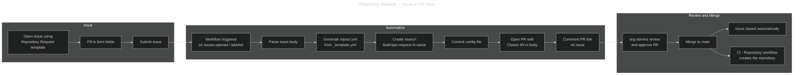

---
hide:
  - toc
---

# Repository Request — Issue to PR

## What

This workflow automates the process of creating a new repository configuration
file from a GitHub issue. A contributor opens a structured issue, the workflow
generates the YAML config, commits it to a new branch, and opens a Pull Request
for review. When the PR is merged the issue is automatically closed.

## Why

The PR-based GitOps flow for creating repositories requires contributors to
manually copy `repos/_template.yml`, fill it in, and open a PR with the correct
template. This two-step issue-to-PR automation removes that friction: a
contributor only needs to fill in a web form and the rest is handled by the
pipeline, while the code-review gate is preserved.

## How



### Step-by-Step

1. **Open an issue** — navigate to the **Issues** tab of the `.github`
   repository and click **New issue**. Select the **Repository Request**
   template.
2. **Fill in the form** — provide the repository name, description, type,
   owning team, visibility, and any optional fields (topics, template,
   features, notes).
3. **Submit the issue** — the `repo-request` label is applied automatically.
4. **Review the PR** — the workflow opens a PR targeting `main` and posts a
   comment with the PR link. Assign a reviewer from the `org-admins` team.
5. **Merge** — once approved, merging the PR triggers the
   **CI - Repository** workflow which creates and onboards the repository.
   The issue is closed automatically via the `Closes #N` reference in the
   PR body.

### Issue Form Fields

| Field | Required | Description |
| ----- | -------- | ----------- |
| **Repository Name** | ✅ | Follows the `svc-` · `lib-` · `infra-` · `sandbox-` convention. Used as the file name under `repos/`. |
| **Description** | ✅ | Short one-line description for the GitHub repository page. |
| **Repository Type** | ✅ | One of `svc`, `lib`, `infra`, or `sandbox`. |
| **Owning Team** | ✅ | Must already exist in the GitHub organization. |
| **Visibility** | ✅ | `private` (default), `internal`, or `public`. |
| **Topics** | ❌ | Comma-separated list of topics. Lowercase, hyphens only, max 20. |
| **Template Repository** | ❌ | Bootstrap the new repository from an existing template (e.g. `irishlab-io/template-python-service`). Leave blank to start from scratch. |
| **Features** | ❌ | Checkboxes to enable Wiki, Projects, or Discussions. |
| **Notes** | ❌ | Free-text notes visible in the PR only (not applied to the repository). |

### Generated Config File

The workflow generates a `repos/<name>.yml` file from the form data. Example:

```yaml
---
# Generated from issue #42 by @contributor
name: "svc-payments-api"
description: "Payments API service"
visibility: private

type: svc
team: "backend"

topics:
  - python
  - api

template: ""

features:
  wiki: false
  projects: false
  discussions: false

notes: ""
```

### Workflow File

The workflow is defined in `.github/workflows/issue-to-pr.yml` and is
triggered by the `issues` event (`opened` and `labeled` types). It only runs
when the issue carries the `repo-request` label.

#### Required Permissions

The `GITHUB_TOKEN` used by the workflow requires the following permissions:

| Permission | Access | Why it is needed |
| ---------- | ------ | ---------------- |
| `contents` | write | Create the feature branch and commit the config file |
| `pull-requests` | write | Open the Pull Request |
| `issues` | write | Post a comment with the PR link |

#### Error Handling

If a config file for the requested repository name already exists under
`repos/`, the workflow:

1. Posts a comment on the issue explaining the conflict.
2. Exits with a non-zero status (the job fails visibly).

The contributor should either choose a different name or update the existing
file directly via a PR.

## Related Documents

- [Repository Onboarding](repo-onboarding.md)
- [Pipeline Overview](overview.md)
